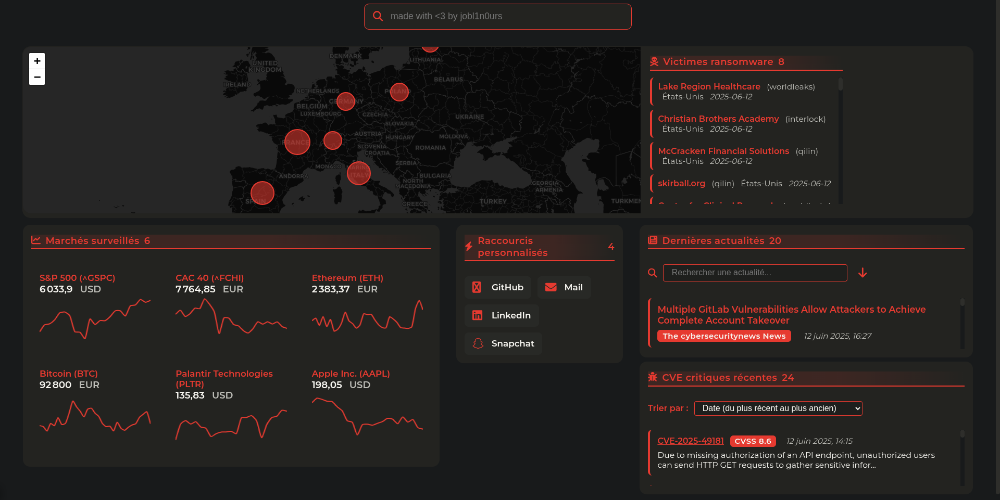

# SecuDash - Tableau de Bord de Cybersécurité

SecuDash est un tableau de bord de cybersécurité tout-en-un qui agrège et affiche en temps réel des informations critiques sur les menaces, les vulnérabilités, les attaques ransomware et les marchés financiers liés à la cybersécurité.



## 🔍 Fonctionnalités

- **Actualités de Cybersécurité** : Agrégation des dernières actualités provenant de multiples sources spécialisées
- **CVE Critiques** : Surveillance des vulnérabilités critiques récentes (score CVSS ≥ 8.0)
- **Carte des Ransomwares** : Visualisation géographique des attaques ransomware récentes en Europe et aux États-Unis
- **Marchés Financiers** : Suivi des actifs financiers pertinents (actions de cybersécurité, indices, cryptomonnaies)
- **Raccourcis Personnalisables** : Accès rapide à vos outils et ressources de cybersécurité préférés
- **Barre de Recherche Google** : Recherche web intégrée
- **Interface Responsive** : S'adapte à tous les types d'écrans
- **Tuiles interactives** : les tuiles sont utilisables en plein écran pour une meilleure visualisation
- **Mode Sombre** : Interface optimisée pour réduire la fatigue oculaire
- **Mise en Cache** : Performances optimisées grâce à la mise en cache des données
- **Personnalisation** : Couleurs et sources d'information configurables

## 🛠️ Technologies Utilisées

- **Backend** : Python 3.x avec Flask
- **Frontend** : HTML5, CSS3, JavaScript vanilla
- **Cartographie** : Leaflet.js
- **Graphiques** : Chart.js
- **Icônes** : Font Awesome
- **APIs Externes** :
  - NVD (National Vulnerability Database) pour les CVEs
  - Ransomware.live pour les données sur les attaques
  - Yahoo Finance (via yfinance) pour les données financières
  - CoinGecko pour les cryptomonnaies
  - Flux RSS pour les actualités

## 🐳 Déploiement avec Docker

Une image Docker officielle est disponible pour exécuter SecuDash dans un conteneur isolé sans avoir à installer manuellement les dépendances.

### Démarrage rapide

```bash
# Télécharger et exécuter le conteneur
docker run -d --name secudash -p 5000:5000 joblinours/secudash:latest
```

L'application sera accessible à l'adresse http://localhost:5000 dans votre navigateur avec la configuration par défaut.

Pour plus d'informations sur l'utilisation de l'image Docker, consultez le [référentiel Docker Hub](https://hub.docker.com/r/joblinours/secudash).

## Déploiement manuel

### 📋 Prérequis

- Python 3.8+ 
- pip (gestionnaire de paquets Python)
- Connexion Internet (pour récupérer les données en temps réel)
- 50 Mo d'espace disque minimum (pour le code et le cache)

### 🚀 Installation

1. Clonez le dépôt :
   ```bash
   git clone https://github.com/joblinours/SecuDash.git
   cd SecuDash
   ```

2. Créez un environnement virtuel (recommandé) :
   ```bash
   python -m venv venv
   source venv/bin/activate  # Sur Windows : venv\Scripts\activate
   ```

3. Installez les dépendances :
   ```bash
   pip install -r requirements.txt
   ```

### ⚙️ Configuration

SecuDash nécessite quelques fichiers de configuration pour fonctionner correctement. Tous ces fichiers doivent être placés dans le répertoire `.config` :

#### 1. Configuration Principale (`secu_dash_config.json`)

```json
{
  "refresh_minutes": 60,
  "colors": {
    "main": "#e63a30",
    "bg": "#181a1b",
    "card": "#232320",
    "text": "#f7f6f1"
  }
}
```

#### 2. Sources d'Actualités (`rss_feeds.json`)

```json
[
  {
    "title": "The Hacker News",
    "url": "https://feeds.feedburner.com/TheHackersNews"
  },
  {
    "title": "Threatpost",
    "url": "https://threatpost.com/feed/"
  },
  {
    "title": "CERT-FR",
    "url": "https://www.cert.ssi.gouv.fr/feed/"
  },
  {
    "title": "ZATAZ",
    "url": "https://www.zataz.com/feed/"
  },
  {
    "title": "The cybersecuritynews News",
    "url": "https://cybersecuritynews.com/feed/"
  }
]
```

#### 3. Marchés Financiers (`markets.json`)

```json
[
  {
    "symbol": "CRWD",
    "name": "CrowdStrike",
    "type": "stock"
  },
  {
    "symbol": "PANW",
    "name": "Palo Alto Networks",
    "type": "stock"
  },
  {
    "symbol": "FTNT",
    "name": "Fortinet",
    "type": "stock"
  },
  {
    "symbol": "^IXIC",
    "name": "NASDAQ",
    "type": "index"
  },
  {
    "symbol": "BTC",
    "name": "Bitcoin",
    "type": "crypto"
  },
  {
    "symbol": "ETH",
    "name": "Ethereum",
    "type": "crypto"
  }
]
```

#### 4. Raccourcis Personnalisés (`shortcuts.json`)

```json
[
  {
    "name": "CVE Details",
    "url": "https://www.cvedetails.com/",
    "icon": "fa-solid fa-bug"
  },
  {
    "name": "Shodan",
    "url": "https://www.shodan.io/",
    "icon": "fa-solid fa-search"
  },
  {
    "name": "VirusTotal",
    "url": "https://www.virustotal.com/",
    "icon": "fa-solid fa-virus"
  },
  {
    "name": "AbuseIPDB",
    "url": "https://www.abuseipdb.com/",
    "icon": "fa-solid fa-ban"
  },
  {
    "name": "Have I Been Pwned",
    "url": "https://haveibeenpwned.com/",
    "icon": "fa-solid fa-unlock"
  }
]
```

### 🖥️ Lancement de l'Application

Une fois configuré, lancez SecuDash avec la commande suivante :

```bash
cd full_code/main
python main.py
```

L'application sera accessible à l'adresse http://localhost:5000 dans votre navigateur.

Pour exposer l'application sur votre réseau local, utilisez :

```bash
python main.py --host 0.0.0.0
```

## 📁 Structure du Projet

```
SecuDash/
├── main/
│   └── main.py                  # Point d'entrée de l'application
├── .config/                     # Répertoire de configuration
│   ├── secu_dash_config.json    # Configuration principale
│   ├── rss_feeds.json           # Sources d'actualités
│   ├── markets.json             # Marchés financiers à suivre
│   └── shortcuts.json           # Raccourcis personnalisés
├── .cache/                      # Données mises en cache
│   ├── news.json                # Cache des actualités
│   ├── cves.json                # Cache des CVEs
│   ├── ransomware.json          # Cache des données ransomware
│   └── markets.json             # Cache des données de marché
└── README.md                    # Ce fichier
```

## 🔧 Personnalisation Avancée

### Modifier les Couleurs

Modifiez le fichier `.config/secu_dash_config.json` pour changer les couleurs du tableau de bord :

- `main` : Couleur principale (liens, titres, accents)
- `bg` : Couleur d'arrière-plan
- `card` : Couleur des cartes/widgets
- `text` : Couleur du texte principal

### Ajouter des Sources d'Actualités

Ajoutez des flux RSS dans le fichier `.config/rss_feeds.json` en suivant le format :

```json
{
  "title": "Nom de la Source",
  "url": "https://url-du-flux-rss.com/feed"
}
```

### Ajouter des Actifs Financiers

Ajoutez des actions, indices ou cryptomonnaies dans `.config/markets.json` :

```json
{
  "symbol": "SYMBOLE",
  "name": "Nom de l'Actif",
  "type": "stock|index|crypto"
}
```

## 📈 Fonctionnement Interne

SecuDash fonctionne selon le principe suivant :

1. Au démarrage, l'application vérifie si des données en cache existent
2. Un thread en arrière-plan est lancé pour rafraîchir périodiquement les données
3. Les requêtes aux APIs externes sont effectuées selon la fréquence configurée
4. Les données récupérées sont mises en cache pour optimiser les performances
5. L'interface web affiche les données avec une mise à jour dynamique côté client

## ⚠️ Limitations Connues

- Les APIs non authentifiées peuvent être soumises à des limitations de taux
- La carte des ransomwares ne montre que les attaques récentes (7 derniers jours)
- Le suivi des cryptomonnaies est limité à Bitcoin et Ethereum via CoinGecko
- Certaines données peuvent être retardées en fonction des sources

## 🤝 Contribution

Les contributions sont les bienvenues ! Pour contribuer :

1. Forkez le projet
2. Créez une branche pour votre fonctionnalité (`git checkout -b feature/amazing-feature`)
3. Committez vos changements (`git commit -m 'Add some amazing feature'`)
4. Poussez vers la branche (`git push origin feature/amazing-feature`)
5. Ouvrez une Pull Request

## 📄 Licence

Ce projet est sous licence MIT. Voir le fichier `LICENSE` pour plus de détails.

## 👨‍💻 Auteur

- **joblinours** - [GitHub](https://github.com/joblinours)

---

Créé avec ❤️ par joblinours
